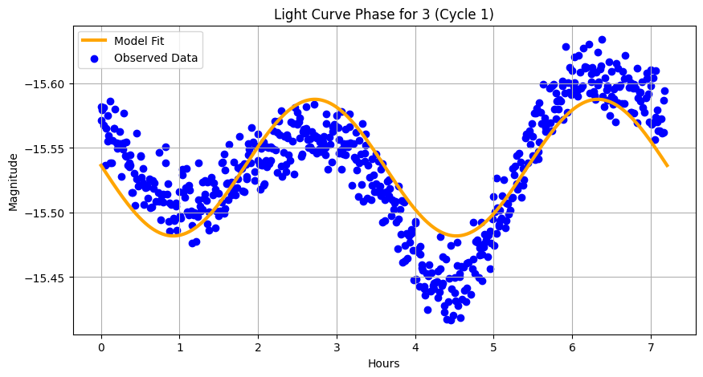

# Astroinformatics Bootcamp 2025
## Group 1 - Incorporation of TESS Data
### Project Overview
Goal: Identify interesting **lightcurves** algorithmically.
- Determine if there are any overlapping targets between Cycle 1 and Cycle 2. Compare these targets by their periods and amplitudes.

    <img src="data:image/jpeg;base64,/9j/4AAQSkZJRgABAQAAAQABAAD/2wCEAAkGBxMSEBUUEhMUFhUVGBsaGRYYGBsWFhsXGxgXFxYYGRgdHyggGR0xHhcVITEhJSktLi4uGCAzODMuNygtLisBCgoKDg0OGxAQGi0fHyItLTUtNjUtLS0tMS0tLS0tLy02Ly0tLS8yLS0tKy0tLS0tLS0vLS0tLy0vLS01LS0tLf/AABEIAL0BCwMBIgACEQEDEQH/xAAcAAEAAgMBAQEAAAAAAAAAAAAABQYDBAcBAgj/xABCEAABAwIEAwUFBQYFAwUAAAABAAIRAyEEEjFBBQZREyIyYXEHQoGRoVJiwdHwFCMzcpKxQ4KywvFTouEVFiRUg//EABoBAQADAQEBAAAAAAAAAAAAAAABAwQCBQb/xAAuEQACAgEEAQIEBAcAAAAAAAAAAQIDEQQhMUESE7EicZHRBTJR4RRCYYGh8PH/2gAMAwEAAhEDEQA/AO4oiIAiIgCIiAIiIAiIgCIiAIiIAiIgCIiAIiIAiIgCIiAIii+OcwYbBtzV6rWmJDJl7tu63U3+ClJvZENpckoigeXub8JjIFKpD/8ApP7tT4DR3q0lTyOLTwwmmsoIiKCQiIgCIiAIiIAiIgCIiAIiIAiIgCIiAIiIAiIgCIiAIiIAiIgCEqP41xqhhKfaYioGNmBqST0a0XJ9FyLnLnbE4prqQDaNB3uhwc6o2Y8YsRIuGwNiSra6pTZXOxQRcOcfaNTofu8IadaqdXTmps+Is8+QNt+i5PjsbUrV3VarxUqO1eYidBbSB5WWsdBp6e96n9fBev2Pd9B084/OfRehXVGHBhnY58ntIw6zgPv9L6jcH0urrwDnLH4Wm19YGrhiYBqeM+TH+LTd0jzVLd4h4SfLwjyO3RZKlZ5cMz8+UQ0ky0eQBsB9F1KClszmMnHdHceXuecJi4aH9nUP+HUhpJ+6fC74GfJWZfmVlnWLSfte7PW+nqrPyxzhjaNVlKnU7dr3BrWVCSCTs1x7zd/LyWWzS9xZphqOpI7miw4So5zGue3I4iS2Zg9JgT8gsyxGsIiIAiIgCIiAIiIAiIgCIiAIiIAiLDi8XTpNL6j2saNS4gD6oDMipvEPaPhKc5M9T70BjPm4g/RQFb2vN/w8Nn/leX/UMj6qMg6ii4/S9tLzULTgmyDlymsWuJifsEfVTOH9r2Ht2+Gr0vvA06jfo4OPwCZB0dFCcD5tweLgUK7C4/4bpZU/odDj8ApitUDWlxmGgkwC4wBJgC5PkLqQfapPNvtDoYdrmYdzatecogE02nq51g7ezSTIvCp/NPtFrYhzmYZ5o0IjNEVXC0mdWX0AgxqdhSGeE3Anbc+XotlWm7mZbNR1E2+McXrYp4fXquqO2BgNaOjQAGjbQdJK1xWIPizAxmBHd+X4iCNl8Hw7em/qf7XXr9tD5DUev6lbMLGDJl5yZntY4RT16O3/AJHbDydB8zosVWmQLtiDBmzyfQ3RxOYTlJtYadII0/BZ+3JIa+KmwIMEWsGv2A6Xb5bpuidmYHtsDAA2I1PUkakW9F7VaYBgNB0jUjqdz6+VlmrUGgOLDni5cLFoF/D738wkfNXfk/2dftFIVcWKtIOMhn8N5aDvq5sjrDh5ajidsYrLOo1yk8IrXCeWMVi3s7GjDHHxk5WNbu5xMud5QCT5AW7Jy/yjhcIQ+nTb2uXL2hu6N4J0ncjW2wAEvgsHTo0206TQxjAA1o0AAgLOsFt0p/I211KHzCIipLQiIgCIiAIiIAiIgCIiAIiIAiL5qVA1pc4wACSegFyUBB848d/ZMPmaR2jrNm/qY+Q9SFwDjmNq1K5fVe4ud7x1IkiTEEaEC+gCvHNPETjcRUf/AIdIQweegnabk+phVrGYUPbpfYaSQCBJF4v1/BZa27JOzrr7lssRXj32Q1GqJnJTcftEku+oJ+q94hxl9NocKWYTB72nyBUfxMOomYzMmM1g6QGzbcS6x9Fqs4qw+8R6j8letyskG1O2aKkNZmvZs1JBsc5Hl0+K+TVAv72hMyZ9TeN481pHGt/6gWJ+KZ9sIDPWqXnoZHkRoQuy+xjnDEYntcLXcahpMD6dRxl2WcpY929y2HG+szC4xgsJUxBijTc/70Q34uNvxXcPZLhKODpupOYO2qEZ6w0dqWsubAXAgXmdZU8Ax8wcsU8VUqvYRSxIPeYWjIHEDxtF7xZ4mZNnbc9xHDKlGqaVZnZm0uddoaT42xZ46Fs6GLhdp5kxOGc4OLoq0iAHsP7y8OyAe+0gix7t51AIhsU1mIYKGOwzqOZzuxzkS65h1OoPBUIAPZnbYiY11XuOz4M1lKluuTlvEaVIEig5z6Ysaj25SXb5RrHl4uq1nDugxA+1uT+Xop/mblV+DBfmNSkTDagAGWdBVE2O1rGNQe6q+4gNkk5v+0DW5+ei3QkpLKZkkmnue1BYHLA0nqd/0NFu8P4TWxNRjMPQe7MYkA5bEZnOeYa2JHTaxOtj5T5CqY6k2s+q6lTdocsuLBI7mawnYwWwZuuw8M4dTw9JtOkIa0ACTJIAgSTclUW6hR2juy6uhveRXeW+QcLhXtq5S+s0Wc4ktaby5rdA68TFhpEmbaiLBKTk8s2JJLCCIigkIiIAiIgCIiAIiIAiIgCIiAIiIAqd7R+LdnRbRae/VI7u8Tb4F3+kq24is1jHPcYa0Ek+QElcxwVNmOfiMZUqd+nUysbMhoy6RqbAC3QkXVF+ZL01y/bv7HcNvifRHYekKVIBx2OYxqSCXEnpIOu3QhZP2bDVWsfSAIIvcwCMwdoYItIcNZkLypNR8tc12V05CRmyx4su99zffVZ6NPe4LoBjUi0nSJ/ERo5XQj4rBW3kxO4c2IDQ1xbldYTlkF4nrYj1nqFF8Q4ZRhr6tKnBcQGZGuMknK05pLjEG3xUpinuPcaGuzsc0y3PT70NGce82JtuInwlaOIrOrOrVBanRY4NgRmqNBzP+YyiLdxxuMsZ9VOFMfV7LKk5vxIh/CcLmIbgg4gwYpjKDvfT4iVs4bg8P/c4OgBP8Q5W23LYbJ36KZwfFajWtmHtOod4v6hf+6kcFxSk4Ozt7MiNDmBkgTB3kj5rxLvxXVLiK/tv+5rjp6+8kT/6fiC6M1NrAd2lzona8NPwMLcw/CqxdH7Q8jXIA0NibCcuYiAAbrZxXFsOxodmzA6TaN5Djp6L4w3NNAW706zaTO5+nksVmu11kcrPsXKmpdFi5P4TTpvc1xL3jvMc8lxDTq1s2ABPwDgBZWvGYOnVpmnUY17HCC0iR5eh6HZc6/8AcFNlVlVrvC7w3EggAt6aT9F0TB42nVaHU3tcCJsQbHr0XvfhWonbSlZ+ZGG+CjJ44NLh/AKVIR3qgAIHanPDSILbjvWtLpPmo/Bci4KlVc9tEEOvkd3mN8mg6Nm8fhAFlReopNFDSYCIigkIiIAiIgCIiAIiIAiIgCIiAIiIAiIgCIiA0eO4N1bC1qTHBr6lNzWuOgcWkAn4riXKfECHPovZ2dek7LVp3BLgXS4nwgAMMEaEzuu9O8lyT2u8qVKc8Sw5Lqjf47DZpZkFMOgXygWcJNjM91Vzj/MuUdJ9M2c3vDSNfW5j9WJGxUZxStWp1A5uR7Tl/dHuO3nK7eR1iATeRKwcH4oMVSD2OygklxLYgkuaKbR6Nv1HmFIjA05uCSTOYyXzoJO+kxvA+0u1JSjng4w08GpxrHQBTpk9rVaGki+Sc2dxt4gA8iJBLgN5Wfi9Hs8FUazxNLc3xe3Nfe0j0XxwrCOqvqVnggF0MadWtae7I+0bkn7wHur45oxDuwaXAsaKlxmGZ4DSAAPMn4RN9F81rtT6+ojCLyov6noU1+EG32aAxYY0Ztdh+tBdR9XGuzEwCADa3pEG2+pUV2r3EudJNjGkAifkvf2U1HQRIiXOJyta1ty5ztAI3KuVMY8jz/Q16xfeRqZi2vwC+sa1uHH/AMiqKVp7IS6sf/zEZfV5ao3inM4pyzB2J8WIiH7CKO9Mfe8R2y6Krik55JJJJMkm5JOpJ3Xo1aeUlmWy/wA/sZpWJcFgr80saT2NCfvVXEyP5GZQPQly1xzXiCRDmMjTLTp29CWk/VRw4e6JF1qPELStNWus/Pf3K/ORe+F+0/idHTEZx9moxrh6WiPgukcpe2qlVcKeOpiiTYVWS6lP3ge8z1uPRcFpXCyiy6S8eBnPJ+zadQOAc0ggiQQZBB0IO4X0uF+xXnR1Kq3BVnzSq2okmclTXJ/K68DZ0dV3RdReSGsBERdEBERAEREAREQBERAEREAREQBERAF5Kr/M/N+HwYc1zg6tHdpNu6Tpm+yPM7dbLkHEuaMXXqsq1KxzMdmptb3WsdtDfp3pMWvKvrolPfgpsujDbk/QC+ajA4FrgCCIINwQbEEbhVrl7mE4iiytIk917RYMePEyJ6FpBOoO11Ya+Ja1mYm0SIuT5Aak+SpcWnhlqaayj8+c1cHqcE4iXUwTha0uYYzFoAd3RJHfYXfEEG5lWCtUNZlBtB0sqw41AdWtDTlF5EktJMWaHNsQFk49j6nHaxw9OkGUqDi4vdqx0Oa3O4Ay91x2TfMkmLUPmPguJ4W/sXioyjUP8UAim4m4bmgTaZYTb5rNdXPwfpvDf+/UsjJZ+IuXGeY20WdlhXguBguAlosZLT4S6bR1dvCp+P4u+s4BznOyxOY6vi8D3RbQaX81G1MUac5hLb2BtMRIPy+i1cFUk3mXHXz3J+a86jRwqWUsv9ezRK1yZOUKRfUDG3JIvpfcnoBe/qozmLiwqDsaTow7T3n71nj3o3YD4RpubxGbiOMFNgpN8eIu87toz3Wf5ok/dj7SgKlIDMXkyPDax/Ky26ajzfm+uPv9v+FFtmFg1w1t7O8rj6iPxWzhHXhYKcyI129VmqHI+7Q0jUA2nyW4oJhpa1smAOpUPxLE06hgNjz3W5UDXAZjMedh8Oq08Rg2+7/5UpBs18O2yyOKk8PwojDte4GSTE9NrdN/iFqPpeX5fPZZvUi28dFqTwYaNZ1Mh7HEPYQ5p6OBkH5gL9g8FxwxGGo1hpVpsf8A1NDvxX4/fTj8iv1T7OQRwjBT/wDXp/6RC7iQyxoiLsgIiIAiIgCIiAIiIAiIgCItDjHGKOFpl9Z4aALD3neTW6kqUs7IN4N8lc55w9oppvdRweRxaO9WPeAP3BoY6mRNoKrXMXM9XiFJ4d+7Yw5xSbJDqZgHP9pzXZTNh3z0Cqeg/V/1qttOmXMzHbe+IntaoXuc5xLnuJcXG5JJkk+cn6ryB1t18/RfRBEAj0H5/rQheA3kj4aAHS/9lsMpYOUOKuwdUGqHDD1hDiQRIBhtVvUtMzGxcOi6hVwhqubTFQtbo5wu5wNxlOjQfxXFuJY+pXdnqvL3adGhuwa3QDyH5q9cjcwSxmGdLqjLUy0TNKJydSW7R7p6CVk1Fba8vqaaLMPxOkcJ4TRw1Ps6FNrGyXGBcuPic46ucepWDmXgVLHYZ+HrDuvFnDxMcLte07OBv9DYlb+FLsgziHRfQn4xafRZVgNp+YsRw1+Fr1MDjWNcWHuvMjMy+V7DrBG40II2IWjw7CNzPDrNpklx6MaTmj4An4LsHtd4W3GinRw1F9bG0zILIDadM+JtZ7oa0GxDSZkAi0zxXEucyhiA7M18im5ps4OL/wB40jrDHg/FY7amnt2WxkQeMxjqtV1U2LjMDQD3WjyAAA9FOYNja1MT8uh6em6rkrb4YHh0hxDdyDHoFsjssIpe5K4hlOjqADt1MaKv8QxJe+dFMNpNe4kkkk7m8LI/B0wJIAHVSMELg6nU/NXngPLTa1JzzUGYjuDafvSqk2m0ulgKuXJldva5X1BTpkEuJ8unmpyRg18Rjj2XZ1rGl3QcpuLAAkauFttAoarh720P9trqZ565tL2nD0KRp0ZkvqMirUP2u8O436+mirvL+Kzk03G8SyeouW/j81jnSq05RLVLOzPp+Gc4hgEuJAb5kmAPmV+teEYMUMPSpDSnTYz+lob+C4d7LeXv2jHsqOH7vD/vD/OPA353+C74u6HlZE9giIrzgIiIAiIgCIiAIiIAiLlnPPO9R1R2Hwrn0msc5r6nheXNMQ06taDPQn01srrdjwjiyxQWWWPm7nylg3mkxva1QLiYYwkWzHc6GBtuLLkXEsc+vVdVquLqjjJ9DsJ0bsB5LACbnrqfPf8AFJFptGp1J/X4r0qqY1rbk8+y1ze5mwNY06rXAB0ag+EtILXsJ6FpcCfvL3iGEFOplaSWmC1xtmpuEsd6wRPQ5hstcjXy0Gs/q/yUlTpiphjM56HeA3dRcRmHlle7N6VXHZdvZ5OVusEa1tzB03NrfmvAbeR38+iRadxt5fr6r6qMiJ+XTf4detlJB8l0xaI13J6/8KS5bwtari2Nwpio3vtM+EAiXHykxHmRopPlTlSvjKwNSm5lBvje7uA2lraYjvbaWgm8rsHBeCUMIwtoU2szGXEDvOMQC46lZrtQo7Ldmiqhy3exv0pyjNGaBMaTvHkvpEXnG4x0aLWAhrQ0EkmBEkmXE9STclcd9svBWDEh4aGiuxuYtEE1KZeC89TlfTHoAuzKl+1Phva4QVAJNJ1/5XQ0/XIqdRn0210d1/mPzvieWKzZc0Z2jZkl39OvylaeIqFjcmUtPQiD8ir7QxGUwoLnXCkubWEkeF28bs9Bdw9Y6rLRq5OfhIsnUksoq+BrOD/VbuN73vHyGy0w5bWDw9Wu/JSYXu6DbzJNgPMr0PNLd7Gfx6NbDtLTrr+WqmuAcVZRqHtGzI7p1LT1H9pWfiPJ2JpNDhkqGJc1hlzT0uBm9R8utcxAIMOBDhsRB+IKrhfCzeDydeDjyWzi9XtWkVNNgL+nqf15qs4ThlX9ppMY1xe57Q0DU3U5yoO1aQWuc5vhdEt9J0n6ruXs/wCShhyMTXaDXI7gI8DT/uUzmm/Bbv2+YSfJO8l8vDBYYMt2ju9Ud1dGnoBZT6IpjFRWEG87hERdEBERAEREAREQBERAFxz2o8LFLGGoNKzQ8fzt7r/9p/zLsaqPtO4Z22CLx4qDg/8Ay6PHpBDv8qv08/Gxf1Kb4+UGcbc28TJNwNY/Vl5mvJvNuo+X62W9Vxw/ZhRZTYwAy9+r6hEwJPhaAYyjeStEzEbG/qf+Y+a9RHnHzGnXfp+tD81tcOrGlWDmgPDfEDZrmEFtRhJ2ILmz95YBlJ6D5ny+KkOCcAr4xzm0Gju7uMN0kAuAO0bdFzJpLfg6im3sa/EcIKdUMZJDi3I50DMyp/CjaSCJ85GyvvKns3LajK2KfZsOFED3r+Nx90WsIM7wL2flfk+lhWUjUitXphwbULYDA45i2mNhJdBMu7xvBhWZYLdS2sRNtdCW7PGNAEAQBsF6iLKaAiIgCx4ig2oxzHiWuBBHUEQQsiIDhfMvLb8JiHNdJYb03n3mzpP2hNx+YnQFLMyHC2hnT0XeeI8PpV6Zp1WBzTsdQeoOoOtwqRjvZ45pJw9UEH3Klj8wIJ+AXlajSTTzDdGmFqe0jlGI5PoEyHVGTq0EEfCQSFMcJwFPDty0wbmSdyep6q0YvlHGzaiD5h7SP7rJhuSMY7VrWeZcCPpJWWS1E14yT+jLF6aeVgrrqsr3C8LfiHBlOnnd6THqTougcN9n7Gwa1Qu+62zfnqrbgsFTotDabA0Dp+J3V1Ogm95fD7nE7l1uVzlbk2nhofVh9UafZYfujc+ataIvWrrjWsRRmlJt5YREXZAREQBERAEREAREQBERAFjxFFr2OY4S1wLSOoIgj5LIiA/O/FMAaFZ9J13MeWeseE/EXjzWs6Qe9ct21/t/byKv/tM4DUdjKdSiwk12wY+2yBJO3dLP6VIckchupO7bFhhdbJTHeywT3nO0J8gLRqV6n8RFQUnyed6EnNpcFZ5K5QdjiatXO2h7roDc+s5PIQLgQZsbLrPBeD0cJSFKgwMbqd3OO7nuN3O8yt5ogQLAL1YLLZTe5trrUFsERFUWBERAEREAREQBERAEREAREQBERAEREAREQBERAEREAREQBERAEREB4QPkvURAEREAREQBERAEREAREQBERAEREAREQBERAEREAREQBERAEREAREQH/9k=">

<i>TESS Telescope</i>

#

<i>Lightcurve for asteroid "Juno"</i>

### Code Workflow

#### Imports Used
Below are imports that were used across the entire GitHub repository. To get the same results the researcher may have to `pip install` a couple of packages: 
- `pandas`
- `numpy`
- `matplotlib.pyplot`
- `astropy`

#### Step 1: Download Tess Data from Mongo DB
The purpose of this is to download the data onto our local system to decrease program run time. From now on we can get the data from our system locally and not have to wait for MongoDB to respond.
- First cell in `GrabLightCurve/DownloadMongoDB.ipynb` defines a class in order to gain access to the database.
- The `config.ini` file will consist of the username, password, host name and port number.
- This program will take in cycle1 data and cycle2 data and insert it into a pandas data frame. Then the Pandas data frame will be turned into a csv.

#### Step 2: Fit Light Curve
The `GrabLightCurve/FitLightCurve.py` file is ran in Monsoon for collecting large amounts of data. `GrabLightCurve/FitLightCurveTesting.ipynb` is used for testing before stating on a much larger dataset. Both of these programs are nearly identical.
- **Note**: the only difference between these files is `FitLightCurve.py` takes in cmd arguments `python3 FitLightCurve.py [cores] [core_num]` This will allow the program to be run in multiple scripts on Monsoon to accelerate the computation time. Ex. You are running 10 scripts on Monsoon so you will call the program by `python3 FitLightCurve.py 10 0-9`. See the folder `GrabLightCurve/MonsoonScripts` for examples. The file `GenerateJobs.py` automates the creation of these scripts.
- For this program to work `Observations/cycle1.csv` and `Observations/cycle2.csv` need to be found in the same folder the script is in.

This program will iterate through each asteroid and complete the following:
- Create a periodogram based on time (in hours) and absolute magnitude.
- Find the peak power from the periodogram to get the best frequency and period (**Note:** Be sure to double the period).
- Use the frequency that had the peak power, compute a sine curve fit with a Lomb Scargle model.
- This program will output `cycle num, asteroid_id, reduced_chi2 peak_power, period_(hr), amplitude, num_observations` for each asteroid.

#### Step 3: Analyze and Filter Results
Below are the programs that analyze the data. This is where we get to do the science! Before we do the science though we need to do combine all the data across each core into one file for analysis and filtering.
- The file `AnalyzeLightCurve/CombineMonsoonData.py` takes x amount of output files depending on x amount of scripts that were running on Monsoon and outputs data from each core into one file. For this program to work, the researcher must have a folder called `MonsoonDataReturn` holding all the output files from Monsoon. The program will return `cycle1_results.csv` and `cycle2_results.csv`.

Now that we have the data including `cycle num, asteroid_id, reduced_chi2 peak_power, period_(hr), amplitude, num_observations` from Monsoon, we can start filtering asteroids to find ones that are **interesting**.
- The file `AnalyzeLightCurve/FilterLightCurveData.ipynb`

#### Other Code Tools

##### Queue Single Asteroid
The file `GrabLightCurve/QueueSingleAsteroid.ipynb` is similar to `FitLightCurve.py`. These files have the same requirements for input but `QueueSingleAsteroid.ipynb` is used for a single asteroid and takes in a single asteroid id. This is really useful for testing specific cases when we filter down potential interesting asteroids.

##### Count Cycle Items
The file `GrabLightCurve/CountCycleItems.ipynb` was an initial testing file used to count how many asteroids were in each cycle. This also determined how many asteroids where in both cycles. Like `FitLightCurve.py`, `Observations/cycle1.csv` and `Observations/cycle2.csv` must be in the same directory for this program to work.

##### Magnitude Error Test
The file `GrabLightCurve/MagnitudeErrorTest.ipynb` was also an initial testing file used to plot the apparent magnitude with time also tracking the date for a specific asteroid. Like `GrabLightCurve/DownloadMongoDB.ipynb`, the `config.ini` needs to be in the same folder as this program for it to run properly.